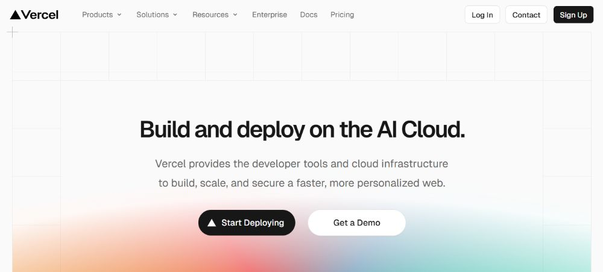
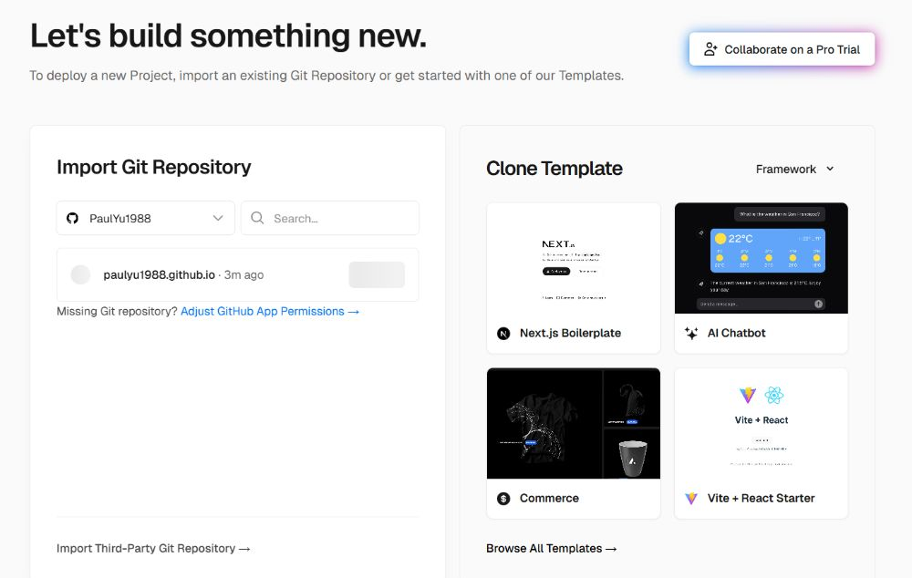

## Introduction

If you want a sleek, fast, and free hosting solution for your personal website (portfolio, blog, resume page, side project landing page), Vercel is one of the top choices. Its free “Hobby” tier gives you zero-cost hosting for noncommercial personal sites. In this tutorial, you’ll see how to go from project idea → live website step by step, and I’ll share tips to help you avoid common traps.



---

## What is Vercel and Why Use It

- Vercel is a cloud platform optimized for deploying front-end projects (static sites, Jamstack, React/Next.js, etc.).
- Its free “Hobby” plan supports personal usage, with generous bandwidth, build limits, and automatic deployments.
- You get previews of branches, integration with Git (GitHub, GitLab, Bitbucket), and seamless updates when you push changes.
- It frees you from managing servers or infrastructure, letting you focus on code and content.

---

## Step 1: Prepare Your Website Project Locally

Before deploying, you need a project. You have a few options:

- **Simple static site** — just HTML, CSS, JavaScript
- **Static site generator** — e.g. Eleventy, Hugo, Gatsby
- **Framework / React / Next.js / Vue / Svelte** — more dynamic but still deployable as static or SSR where supported

For simplicity, let’s assume you’ll start with a static site (HTML + CSS + JS). That requires no build steps. If you use a framework, you will need to configure build commands (but Vercel auto-detects many frameworks).

Make sure your site works locally (e.g. open index.html, test links). Optionally initialize a Git repository:

```bash
git init
git add .
git commit -m "Initial commit"
```
---

## Step 2: Push to a Git Repository (GitHub, GitLab, or Bitbucket)

Vercel integrates best with Git-based workflows, so push your code to one of the supported Git providers:

- Create a repository (public or private)
- Add your project files, commit, and push
- If your project has a build step (e.g. npm run build), make sure your build outputs go to a known folder like dist or public.

---

## Step 3: Sign Up & Log In to Vercel

- Go to vercel.com and sign up or log in.
- Connect your Git provider (you’ll be asked to grant permissions to repositories).
- Once logged in, you're ready to create a new Vercel project.

---

## Step 4: Import Your Project into Vercel

1\. From Vercel dashboard, click “New Project” or “Import Project”.

2\. Select your Git provider and pick your repository.



3\. Vercel will auto-detect the framework or static site; check the build settings (you can override if necessary).

- For static sites, build command may be blank and output directory might be / or public or dist.
- For frameworks like Next.js, check that the correct preset is selected.

4\. Choose settings like root directory, environment variables (if any).

5\. Click Deploy.

Vercel will clone the repo, run the build (if any), and deploy the site. You will get a default .vercel.app or project-based domain (e.g. my-site.vercel.app) right away.

---

## Step 5: Verify and Test Your Deployment

- Vercel shows logs of the deployment process (build, install, output) — watch for errors.
- Visit the provided domain to see your live site.
- Test all pages, links, and assets (images, CSS).
- If the deployment fails, check error logs, missing dependencies, or misconfigured paths.

---

## Step 6: (Optional) Configure a Custom Domain

While the .vercel.app domain works fine, you may want your own domain (e.g. yourname.com). To add one:

1. In your project’s Settings > Domains, click “Add Domain.”
2. Enter your custom domain name and verify domain ownership (via DNS records).
3. Configure DNS records at your domain registrar: usually adding A records or CNAME pointing to Vercel’s servers as instructed.
4. Once DNS propagates, Vercel will issue SSL (automatic).
5. You can set your custom domain as primary, so visitors see that instead of .vercel.app.

---

## Step 7: Continuous Deployment & Updates

One of Vercel’s strengths is automatic updates:

- Every time you git push updates to your repository (especially to your main branch), Vercel auto-triggers a new deployment.
- You can preview feature branches: Vercel creates preview deployments for pull requests or branches, so you can test changes before merging.
- You can disable auto-deploy or ignore certain paths if needed (in Project Settings under Git).

---

## Practical Tips & Best Practices

- Use a simple folder structure so deploy paths don’t break.
- Minify CSS/JS, optimize images, so your site loads fast on the free tier.
- Cache control: leverage HTTP headers to cache static assets.
- Limit build time: free tier has build time quotas—keep builds lean.
- Clean environment variables: avoid exposing secrets; use Vercel’s built-in env var support.
- Monitor usage: bandwidth and build hours are limited; check your usage on Vercel dashboard.
- Set fallback or 404 pages so broken links don’t result in ugly errors.
- Use incremental deployment: don’t redeploy everything if only small parts change.
- Use analytics carefully: many tracking scripts slow load; consider lightweight alternatives.

---

## Summary & Final Thoughts

Building a free personal website with Vercel is remarkably straightforward. The combination of Git integration, automatic builds, previews, and domain support makes it a powerful platform for personal projects. Start with a simple static site, push it to Git, import into Vercel, and deploy. Over time, you can evolve into using frameworks or server-side rendering as your needs grow.
